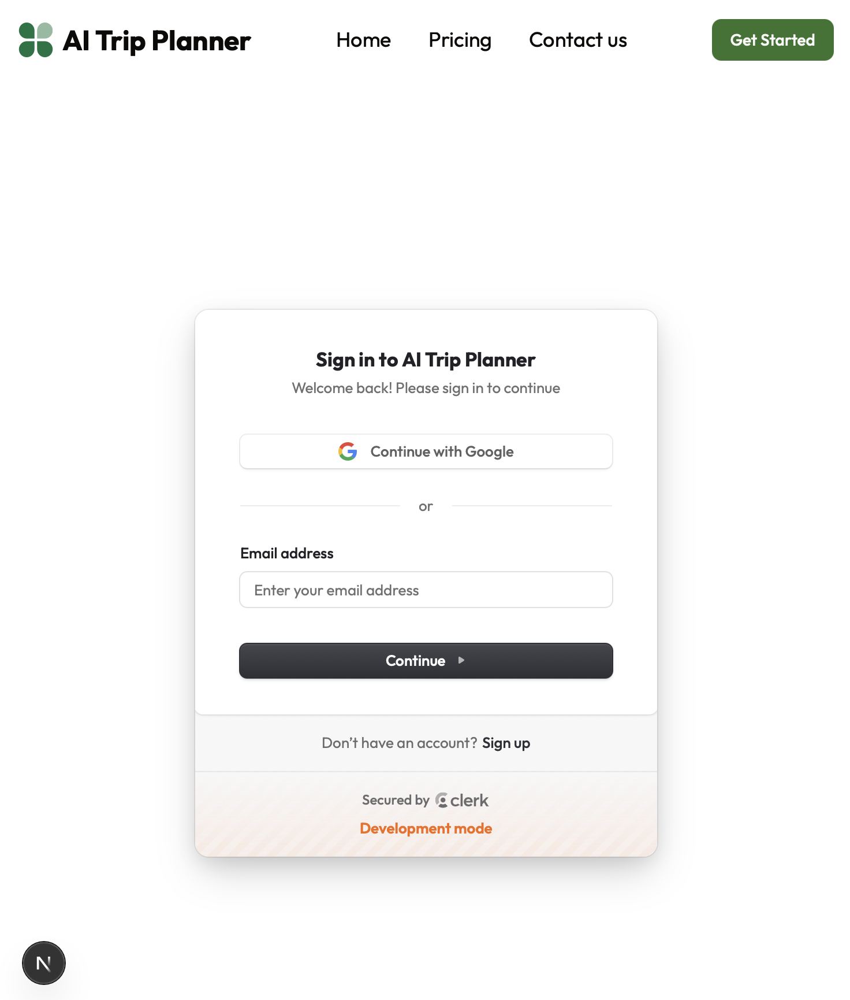
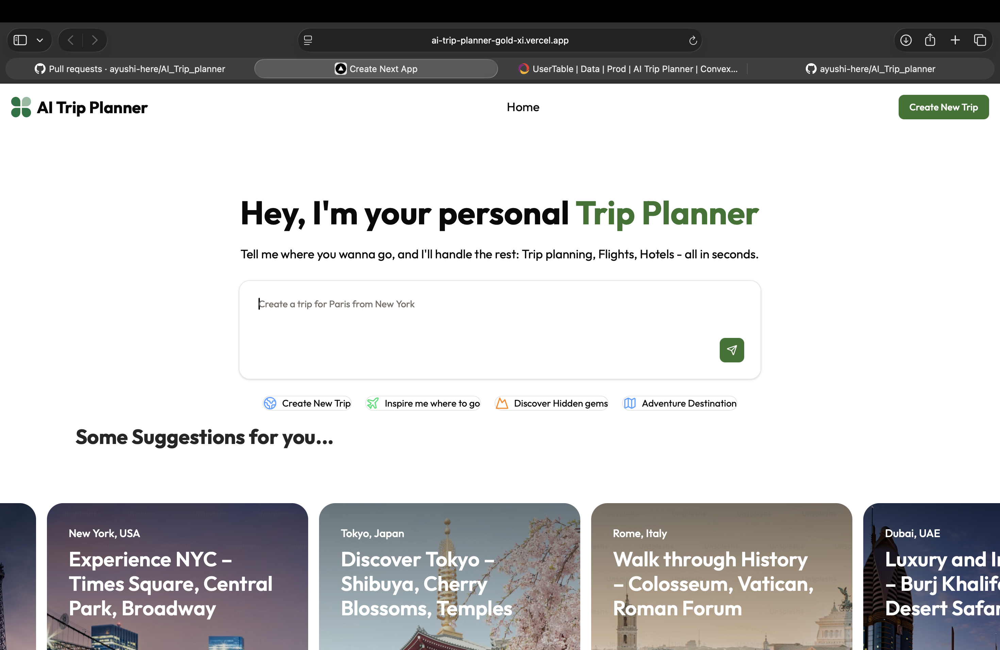
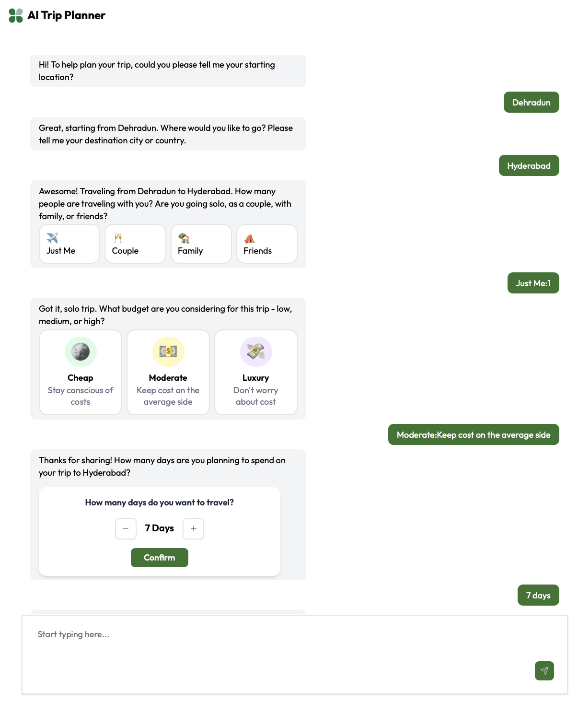
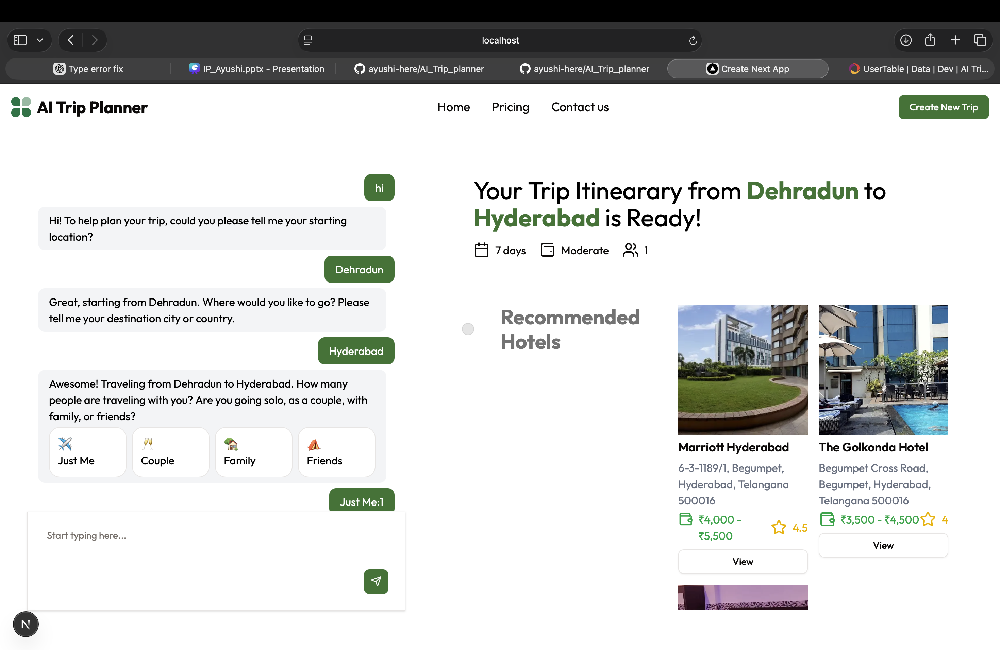
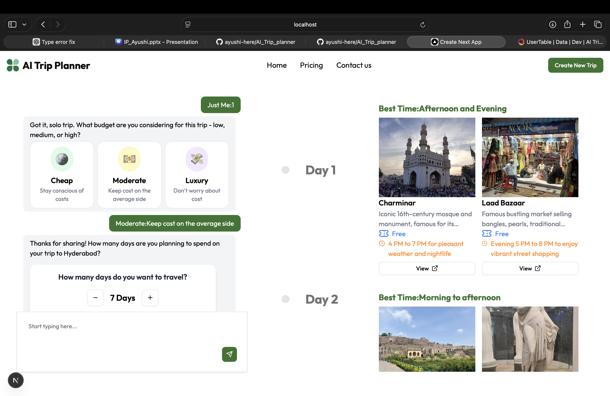
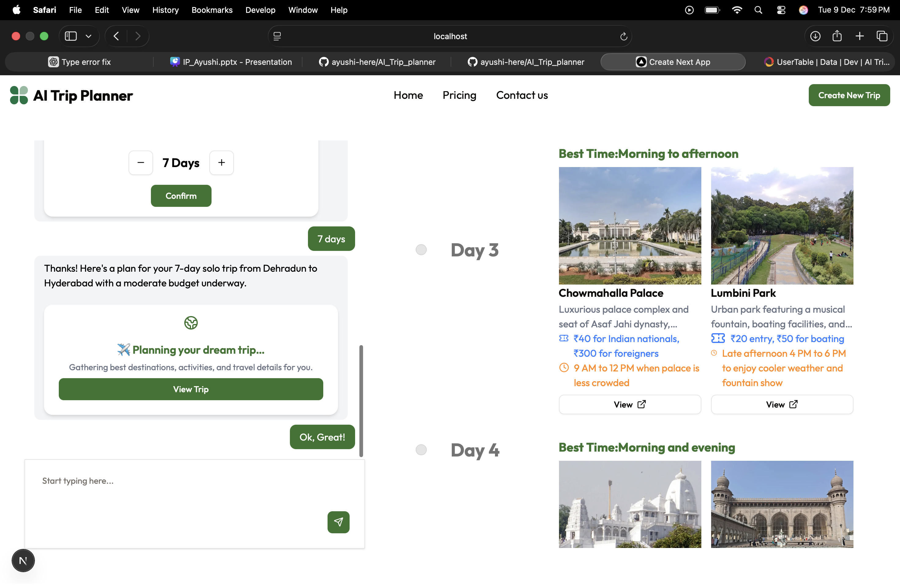

## 📸 Application Screenshots

### 🔐 User Authentication
Secure login system for users before accessing trip planning features.

---

### 🏠 Landing Page
Clean and minimal landing page introducing the AI Trip Planner.

---

### 💬 Trip Input via AI Chat
Users enter trip details such as destination, duration, budget, and group size.

---

### 🏨 AI-Generated Hotel Recommendations
Hotels suggested by AI with pricing, ratings, and real images fetched via Google Places API.

---

### 🗓️ Day-wise Trip Itinerary
Timeline-based UI showing activities, timings, and ticket details.

